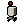

# 🍪 Challenge Encriptador / Alura + Oracle

  


## 📄 Descripción
Este repositorio contiene un proyecto de encriptador de texto desarrollado como parte del challenge de Alura. El encriptador permite cifrar y descifrar mensajes utilizando una técnica de encriptación simple. Este proyecto está diseñado para practicar habilidades de programación.
Se utilizaron las tecnologías de HTML, CSS y JavaScript para la creación de esta página web.

## ✅ Requisitos
- Debe funcionar solo con letras minúsculas.
- No deben utilizarse letras con acentos ni caracteres especiales.
- Debe ser posible convertir una palabra en su versión encriptada y también devolver una palabra encriptada a su versión original.


## 🔩 Funcionamiento
### 🔒 Encriptación
| Entrada | Salida |
|---------|--------|
|    e    | enter  |
|    i    | imes   |
|    a    | ai     |
|    o    | ober   |
|    u    | ufat   |

Ejemplo:
```sh
"gato" => "gaitober"
```

### 🔓 Desencriptación
| Entrada | Salida |
|---------|--------|
| enter   |    e   |
| imes    |    i   |
| ai      |    a   |
| ober    |    o   |
| ufat    |    u   |

Ejemplo:
```sh
"gaitober" => "gato"
```

### 🍫 Modo Oscuro
 

<div style="display: flex; align-items: center;">
  Para ingresar el modo oscuro solo debes dar click en el icono del POD:
  
</div>

## 😺 Autor
<a href="https://linkedin.com/in/alexep11" target="_blank">

</a>
<a href="https://github.com/AlexEP11" target="_blank">

</a>
<a href="https://instagram.com/aleeps11" target="_blank">

</a>  
  